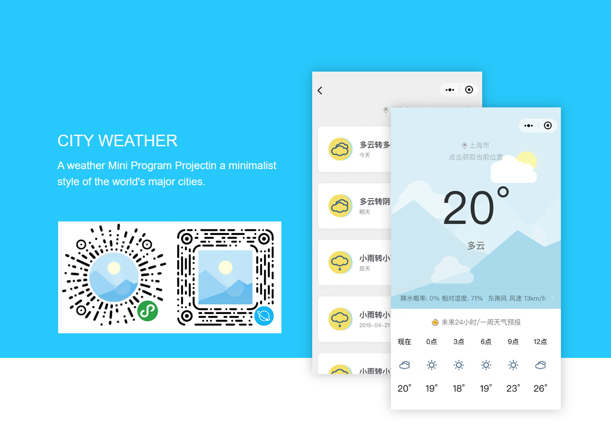

 
 <h2 align="center">城市天气小程序</h2>
 
一个简约的风格呈现世界各大城市天气的小程序

  
  
  
  

### 1. 城市天气 (CityWeather)

一个简约风格的世界主要城市的天气查询小程序。（由于小程序的特性，存在一些关键机密信息，无法开源完整源代码，故将小程序移除了部分依赖于账号的功能，仅作演示）

### 2. 需求

+ 小程序云开发
+ 对象存储
+ 和风天气 API

### 3. 截图

### 4. 如何使用 ?

1. 获取某个分支的代码文件到本地，保留根文件夹 `CityWeather`；
2. 打开微信开发工具，点击 `+` 添加跟文件夹于小程序中；
3. 本代码限制了 AppID 的值，可在项目中修改 `project.config.json` 文件添加 AppID；
4. 本例天气API使用有和风天气提供的免费API，每天免费1000次请求，如遇到获取 `json` 数据错误，请次日再来尝试，亦或是使用自己的天气API；
5. 本例中位置API使用腾讯位置服务SDK，可在 [此处](https://lbs.qq.com/) 注册。

### 5. 特点

当你运行此小程序时，你能够获得以下特性：

- 略去配置城市步骤，直接获取地址查看你所在城市的天气状况；
- 能够获取当前的风向和风速；
- 能够查看未来24小时的天气及气温变化；
- 能够查看未来7天的天气变化及气温变化。

### 6. 历史版本

#### 6.1 V2 版本

`v2.2.3` 修改提示素材和入口。QQ 小程序强制要求改名，改为 `布丁天气`。

`v2.2.2` 更新 CDN 预加载功能，修复个人中心页面顶部状态栏颜色。

`v2.2.1` 更新天气 API 地址。

`v2.2.0` 增加个人中心，教程提示，城市生活指数等新功能。由于 QQ 小程序强制要求改名，故封存这个版本为改名前最终版本。

`v2.1.2` 增加振动反馈效果。

`v2.1.1` 默认城市改为北京市，QQ小程序上线云开发，版本号为 `v2.1.0` 预留一个 debug 版本号。

`v2.1.0` 优化关于页面、反馈页面，新增主题更换。QQ小程序发布。

`v2.0.2` 反馈页面现在可以进行回复消息查看。

`v2.0.0` 重新设计了部分页面。

#### 6.2 V1 版本

`v1.2.3` 包括 `v1.2.2`全部功能，微调UI及更改7天天气预报页面背景颜色。

`v1.2.2` 包括 `v1.2.0`全部功能，优化更新提示，新增降水概率和相对湿度数据。

`v1.2.0` 包括 `v1.1.1`全部功能，并适配最新小程序规范，重新设计部分天气背景。

`v1.1.1` 包括 `v1.0.0` 全部功能，并增加当前天气分享以及7天天气分享，微调UI。

`v1.0.0` 包括当前天气、24小时预报以及7天天气预报功能。 

### 7. 版权

[GPL-3.0 License](https://github.com/pudding0503/CityWeather/blob/master/LICENSE)
